Отлично, давай структурируем весь этот массив информации. Я взял план преподавателя за основу (15 блоков) и наполнил его содержимым из твоих лекций и семинаров, разбив на логические подблоки.

Всё объяснено максимально просто, но с сохранением терминологии из файлов.

---

### Блок 1: Базы данных и СУБД. Введение

Этот блок — фундамент. Здесь мы разбираемся, что это вообще такое.

**1.1. Определения**
*   **БД (База Данных):** Это не просто куча файлов, а *самодокументированное* собрание интегрированных записей.
    *   *Самодокументированное:* содержит метаданные (словарь данных), описывающие саму себя.
    *   *Интегрированное:* данные связаны между собой.
*   **СУБД (Система Управления БД):** Это софт (программа), которая позволяет создавать БД, управлять ею и дает доступ к данным (Oracle, PostgreSQL, SQL Server).

**1.2. Основные требования к БД**
*   **Неизбыточность:** Данные не дублируются (один факт хранится в одном месте).
*   **Целостность:** Данные логически верны и соответствуют правилам.
*   **Безопасность:** Защита от взлома или случайного удаления.
*   **Независимость:** Если мы меняем структуру хранения на диске, программы пользователей не должны ломаться.

**1.3. Классификация СУБД**
*   **По модели данных:**
    *   *Иерархические/Сетевые:* старые, жесткие связи (графы, деревья).
    *   *Реляционные:* данные в таблицах (строки и столбцы), связь через ключи. Самые популярные.
    *   *NoSQL:* для специфических задач (ключ-значение, документы).
*   **По архитектуре:**
    *   *Файл-сервер:* БД лежит на диске, клиент скачивает файлы и обрабатывает у себя (плохо для больших систем).
    *   *Клиент-сервер:* Клиент шлет запрос (SQL), сервер сам ищет данные и отдает только результат.

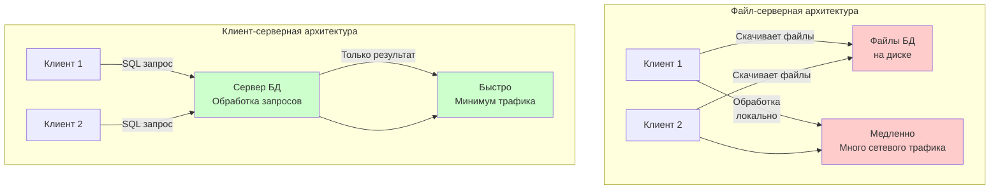

---

### Блок 2: Семантическое моделирование (ER-модель)

Это этап проектирования "на бумаге" (концептуальный уровень), до создания таблиц.

**2.1. Основные понятия ER (Entity-Relationship)**
*   **Сущность (Entity):** Объект реального мира (Студент, Книга). Рисуется прямоугольником.
*   **Атрибут:** Свойство сущности (Имя студента, Год издания). Рисуется овалом.
*   **Связь (Relationship):** Как сущности взаимодействуют (Студент *читает* Книгу). Рисуется ромбом.

**2.2. Типы связей**
*   **1:1 (Один к одному):** Один паспорт — один человек.
*   **1:N (Один ко многим):** Одна группа — много студентов.
*   **M:N (Многие ко многим):** Один студент слушает много курсов, один курс слушают много студентов. *Важно:* В реляционной базе такая связь разрывается через промежуточную таблицу.

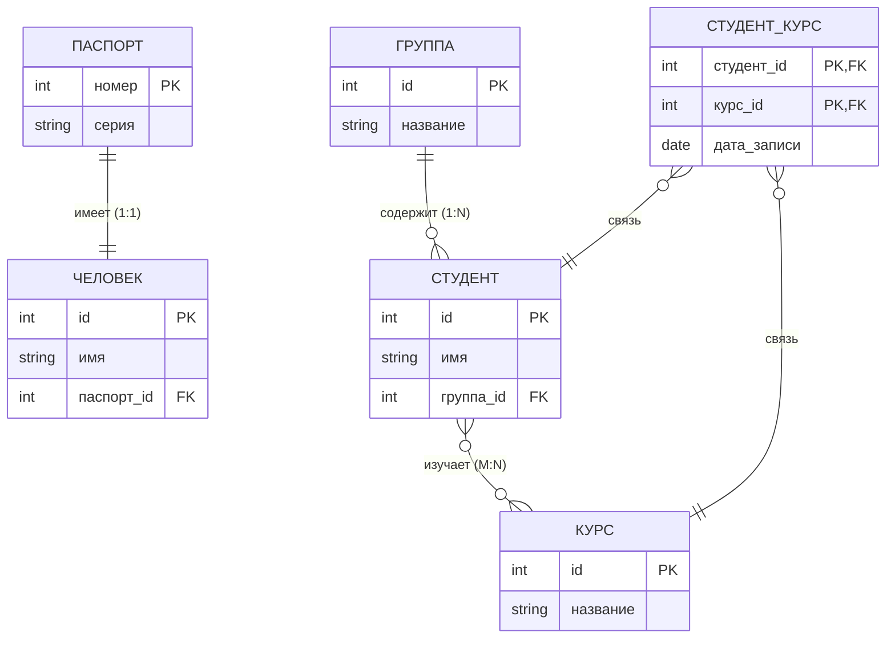

**2.3. Переход от ER к таблицам**
*   Сущности становятся таблицами.
*   Атрибуты становятся столбцами.
*   Уникальный идентификатор сущности становится **Первичным ключом (Primary Key)**.
*   Связи реализуются через **Внешние ключи (Foreign Key)**.

---

### Блок 3: Реляционная модель данных

Математическая основа современных БД (автор Эдгар Кодд, 1970 год).

**3.1. Структурная часть реляционной модели**
*   **Отношение (Relation):** В просторечии — таблица. Математически — подмножество декартова произведения доменов.
*   **Кортеж (Tuple):** Строка таблицы. В реляционной модели:
    - Нет дубликатов кортежей (каждая строка уникальна).
    - Порядок строк не важен (отношение — это множество, а не список).
*   **Атрибут (Attribute):** Столбец таблицы. Имеет имя и домен.
    - Порядок столбцов не важен (доступ по имени).
    - Каждый атрибут имеет атомарное значение (не может быть составным или множественным).
*   **Домен (Domain):** Допустимое множество значений для атрибута. Включает тип данных + семантику (смысл).
    - Пример: домен "возраст" — целые числа от 0 до 120.
    - Пример: домен "дата рождения" — даты от 1900-01-01 до текущей даты.
*   **Схема отношения:** Структура отношения (название + список атрибутов с доменами).
*   **Экземпляр отношения:** Конкретные данные (набор кортежей) в отношении.

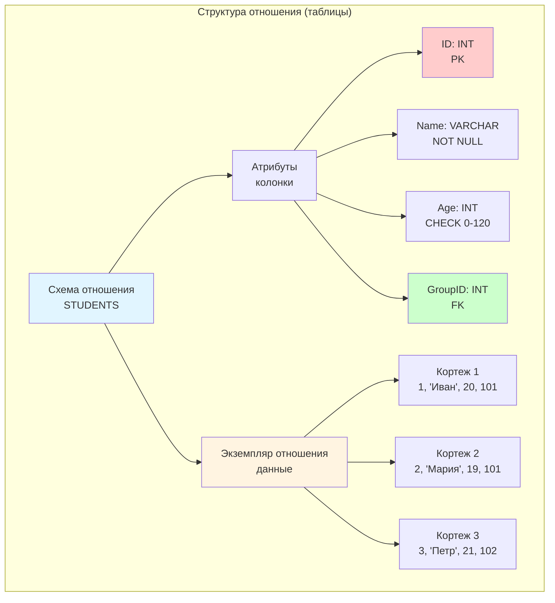

**3.2. Ключи в реляционной модели**
*   **Суперключ (Superkey):** Набор атрибутов, который уникально идентифицирует кортеж. Может содержать лишние атрибуты.
*   **Ключ-кандидат (Candidate Key):** Минимальный суперключ (нельзя убрать ни один атрибут, сохранив уникальность).
*   **Первичный ключ (Primary Key):** Выбранный из ключей-кандидатов для идентификации кортежей. Один на отношение.
*   **Альтернативный ключ (Alternate Key):** Ключ-кандидат, не выбранный в качестве первичного.
*   **Внешний ключ (Foreign Key):** Набор атрибутов в одном отношении, который ссылается на первичный ключ другого отношения.

**3.3. Целостная часть (Integrity Constraints)**
*   **Целостность сущностей (Entity Integrity):** 
    - У каждой строки должен быть уникальный первичный ключ.
    - Первичный ключ не может содержать NULL (не может быть пустым).
*   **Ссылочная целостность (Referential Integrity):** 
    - Внешний ключ должен указывать на существующую запись в родительской таблице.
    - Нельзя сослаться на несуществующего студента, нельзя удалить студента, на которого ссылаются другие записи (если не настроен CASCADE).
*   **Правила ссылочной целостности при удалении/обновлении:**
    - **RESTRICT (NO ACTION):** Запретить удаление/обновление родительской записи, если на нее ссылаются.
    - **CASCADE:** При удалении/обновлении родительской записи автоматически удалить/обновить дочерние.
    - **SET NULL:** При удалении родительской записи установить внешний ключ в NULL (если разрешено).
    - **SET DEFAULT:** При удалении родительской записи установить внешний ключ в значение по умолчанию.
*   **Пользовательская целостность:** Дополнительные правила, заданные пользователем (CHECK constraints, триггеры).

**3.4. Манипуляционная часть**
*   **Реляционная алгебра (Relational Algebra):** Процедурный подход — мы говорим *как* получить данные, описывая последовательность операций.
    - **Операции над множествами:**
        - **Объединение (UNION):** Объединяет два отношения, удаляя дубликаты.
        - **Пересечение (INTERSECT):** Возвращает кортежи, которые есть в обоих отношениях.
        - **Вычитание (MINUS/EXCEPT):** Возвращает кортежи из первого отношения, которых нет во втором.
        - **Декартово произведение (TIMES/CROSS JOIN):** Каждый кортеж первого отношения соединяется с каждым кортежем второго.
    - **Специальные реляционные операции:**
        - **Выборка/Ограничение (SELECT/WHERE):** Фильтрация кортежей по условию.
        - **Проекция (PROJECT):** Выбор определенных атрибутов (колонок).
        - **Соединение (JOIN):** Комбинация выборки и декартова произведения. Типы: внутреннее (INNER), внешнее (LEFT, RIGHT, FULL), естественное (NATURAL).
        - **Деление (DIVISION):** Операция "для всех" (найти студентов, которые записаны на все курсы из заданного списка).
*   **Реляционное исчисление (Relational Calculus):** Декларативный подход — мы описываем *что* хотим получить, а не как.
    - **Исчисление кортежей (Tuple Calculus):** Переменные представляют кортежи (строки).
    - **Исчисление доменов (Domain Calculus):** Переменные представляют значения доменов (атрибутов).
    - SQL основан на реляционном исчислении кортежей.
*   **Эквивалентность алгебры и исчисления:** Любой запрос, выразимый в реляционной алгебре, можно выразить в реляционном исчислении, и наоборот. Это теоретическая основа SQL.

---

### Блок 4: Теория проектирования (Нормализация)

Как правильно разбить данные по таблицам, чтобы не было мусора и дублей.

**4.1. Функциональная зависимость (ФЗ)**
*   **Определение:** Если мы знаем значение атрибута (или набора атрибутов) `A`, мы однозначно знаем значение атрибута `B`. Обозначается `A -> B`.
*   **Пример:** Зная ИНН, мы точно знаем ФИО человека. ИНН -> ФИО.
*   **Детерминант:** Атрибут (или набор атрибутов) слева от стрелки (A). От него зависит другой атрибут.
*   **Зависимый атрибут:** Атрибут справа от стрелки (B). Зависит от детерминанта.
*   **Полная функциональная зависимость:** Атрибут зависит от всего составного ключа, а не от его части.
*   **Частичная функциональная зависимость:** Атрибут зависит только от части составного ключа (проблема 2НФ).
*   **Транзитивная зависимость:** Атрибут зависит от неключевого атрибута, который зависит от ключа (проблема 3НФ).

**4.2. Нормальные формы (НФ)**
Процесс нормализации — это пошаговое приведение таблицы к нормальным формам для устранения избыточности и аномалий.

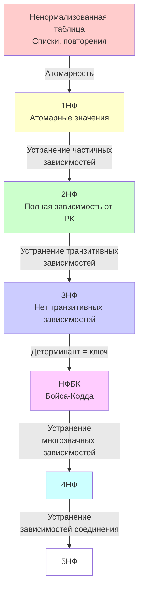

**4.2.1. Первая нормальная форма (1НФ):**
*   **Требование:** Атомарность значений. В каждой ячейке должно быть одно атомарное (неделимое) значение.
*   **Проблемы до 1НФ:**
    - Списки значений в одной ячейке (например, телефоны через запятую)
    - Повторяющиеся группы атрибутов
*   **Решение:** Вынести множественные значения в отдельные строки или таблицы.

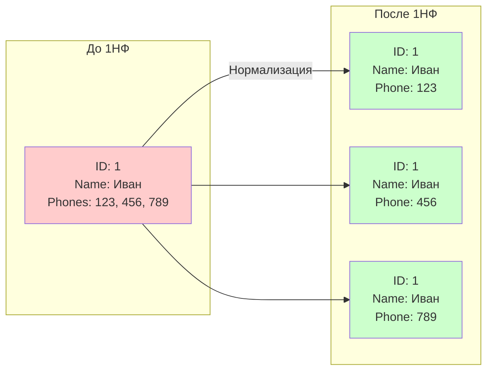

**4.2.2. Вторая нормальная форма (2НФ):**
*   **Требование:** 1НФ + все неключевые атрибуты полностью зависят от первичного ключа (нет частичных зависимостей).
*   **Проблема:** Если первичный ключ составной (из нескольких атрибутов), некоторые атрибуты могут зависеть только от части ключа.
*   **Пример проблемы:** Таблица "Студент-Курс" с ключом (СтудентID, КурсID) и атрибутом "ИмяПреподавателя", который зависит только от КурсID.
*   **Решение:** Вынести частично зависимые атрибуты в отдельную таблицу.

**4.2.3. Третья нормальная форма (3НФ):**
*   **Требование:** 2НФ + нет транзитивных зависимостей (неключевые атрибуты не зависят от других неключевых атрибутов).
*   **Проблема:** Атрибут зависит от неключевого атрибута, который зависит от ключа.
*   **Пример:** Студент -> Группа -> Староста. "Староста" зависит от "Группа", а "Группа" зависит от "СтудентID".
*   **Решение:** Вынести транзитивно зависимые атрибуты в отдельную таблицу (создать таблицу "Группы" с атрибутом "Староста").

**4.2.4. Нормальная форма Бойса-Кодда (НФБК):**
*   **Требование:** Усиленная 3НФ. Любой детерминант (атрибут, от которого зависит другой атрибут) должен быть потенциальным ключом (ключом-кандидатом).
*   **Проблема 3НФ, которую решает НФБК:** В 3НФ могут остаться зависимости, где детерминант не является ключом, но является частью составного ключа.
*   **Пример:** Таблица с ключом (СтудентID, КурсID) и атрибутом "Оценка". Если есть зависимость (СтудентID, КурсID) -> Оценка, но также СтудентID -> Группа (где Группа не ключ), то это нарушение НФБК.

**4.2.5. Четвертая нормальная форма (4НФ):**
*   **Требование:** НФБК + нет многозначных зависимостей (Multivalued Dependencies).
*   **Многозначная зависимость:** Атрибут A многозначно определяет атрибут B, если для каждого значения A существует множество значений B, независимое от других атрибутов.
*   **Пример:** Студент может изучать несколько курсов и иметь несколько хобби. Если курсы и хобби независимы, возникает многозначная зависимость.
*   **Решение:** Разделить на отдельные таблицы.

**4.2.6. Пятая нормальная форма (5НФ) и далее:**
*   Борьба со сложными зависимостями соединения (Join Dependencies).
*   На практике редко используется, так как приводит к излишней декомпозиции.

**4.3. Денормализация**
*   Иногда намеренное нарушение нормальных форм для улучшения производительности.
*   Применяется в хранилищах данных (DWH) для ускорения аналитических запросов.
*   Компромисс между нормализацией (меньше дублей, но больше JOIN) и денормализацией (больше дублей, но меньше JOIN).

**4.4. Аномалии данных**
*   **Аномалии вставки:** Невозможность вставить данные без других данных (из-за зависимостей).
*   **Аномалии обновления:** Нужно обновлять данные в нескольких местах (риск несогласованности).
*   **Аномалии удаления:** Удаление одних данных приводит к потере других данных.
*   Нормализация устраняет эти аномалии.

---

### Блок 5: Хранилища данных (DWH) и ETL

Когда данных много и нужна аналитика, обычная БД тормозит. Нужны хранилища.

**5.1. Подходы к проектированию**
*   **Билл Инмон (Top-down):** Сначала строим одно гигантское идеальное корпоративное хранилище (DWH), а из него нарезаем маленькие витрины данных для отделов. Это долго и дорого, но надежно.
*   **Ральф Кимбалл (Bottom-up):** Сначала строим витрины для отделов, а потом соединяем их в общее хранилище. Быстрее, но может быть бардак в данных.

**5.2. Процессы загрузки**
*   **ETL (Extract, Transform, Load):** Извлекаем данные -> Преобразуем (чистим) на отдельном сервере -> Загружаем в DWH. Классика.
*   **ELT (Extract, Load, Transform):** Извлекаем -> Загружаем "как есть" в мощную БД -> Преобразуем силами этой БД. Подходит для Big Data и мощных облаков.

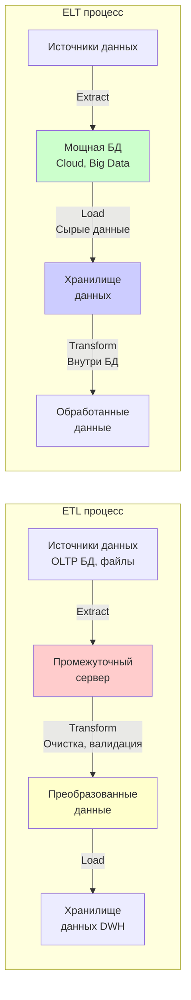

---

### Блок 6: Транзакции

Транзакция — это неделимая единица работы (например, перевод денег: снять у одного, добавить другому).

**6.1. Определение транзакции**
*   **Транзакция:** Последовательность операций над БД, которая выполняется как единое целое. Либо все операции выполняются успешно, либо ни одна из них не выполняется.
*   **Начало транзакции:** `BEGIN TRANSACTION` или `START TRANSACTION`
*   **Завершение транзакции:** `COMMIT` (сохранить изменения) или `ROLLBACK` (отменить все изменения)

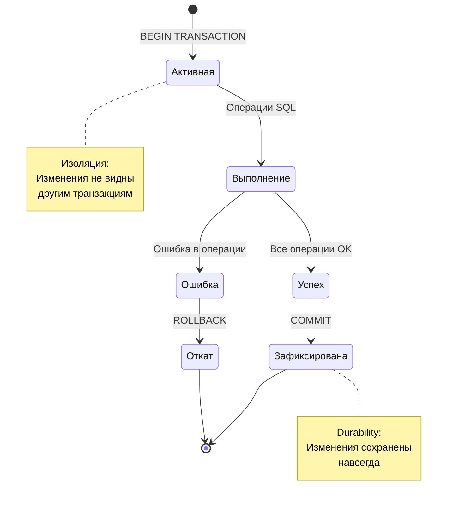

**6.2. Свойства ACID**
*   **A (Atomicity) Атомарность:** Либо все выполняется, либо ничего. Если хотя бы одна операция в транзакции не выполнилась, откатываются все изменения.
*   **C (Consistency) Согласованность:** Транзакция переводит БД из одного правильного (согласованного) состояния в другое. Все ограничения целостности должны выполняться.
*   **I (Isolation) Изоляция:** Параллельные транзакции не мешают друг другу. Результаты незавершенной транзакции не видны другим транзакциям.
*   **D (Durability) Долговечность:** Если система сказала "ОК" (COMMIT), данные сохранены даже при отключении питания или сбое системы.

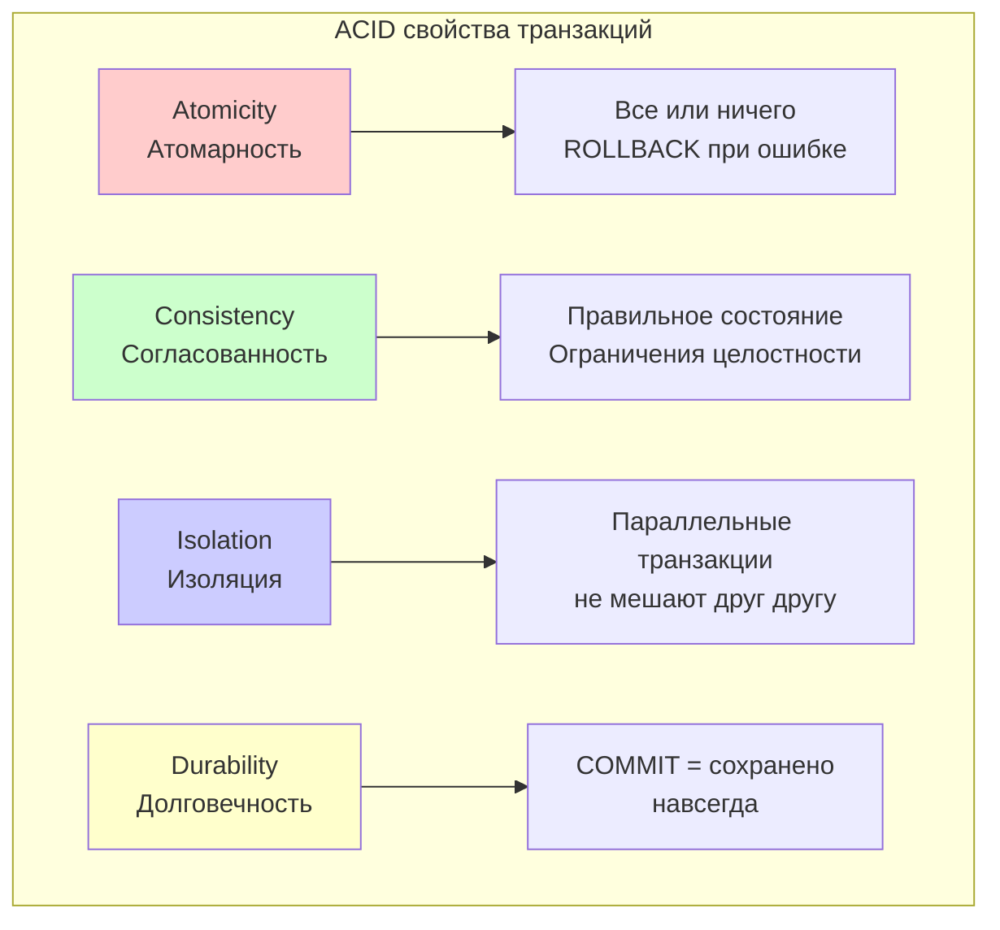

**6.3. Уровни изоляции транзакций**
Чем строже изоляция, тем медленнее работа, но меньше аномалий.
*   **Read Uncommitted (Чтение незафиксированных данных):** Самый слабый уровень. Можно читать незафиксированные данные других транзакций. Позволяет максимальную параллельность, но создает множество проблем.
*   **Read Committed (Чтение зафиксированных данных):** Читаем только зафиксированные данные. Это стандартный уровень в большинстве СУБД. Блокировки снимаются сразу после чтения.
*   **Repeatable Read (Повторяемое чтение):** Строки, которые мы читали, не меняются до конца нашей транзакции. Блокировки удерживаются до COMMIT/ROLLBACK.
*   **Serializable (Сериализуемый):** Полная изоляция, как будто все транзакции работают строго по очереди. Аномалий нет, но очень медленно из-за большого количества блокировок.

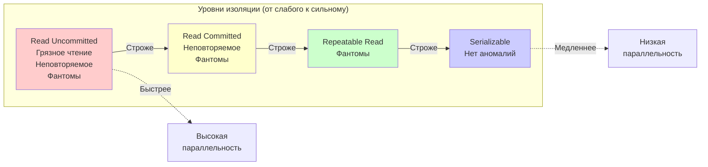

**6.4. Неблагоприятные эффекты параллельного выполнения транзакций (Аномалии)**
*   **Грязное чтение (Dirty Read):** Транзакция А читает данные, которые транзакция Б еще не зафиксировала. Если Б откатится, А прочитала "мусор". *Защита:* Read Committed и выше.
*   **Неповторяемое чтение (Non-Repeatable Read):** Транзакция А читает строку дважды, а между чтениями транзакция Б изменила эту строку. Результаты двух чтений разные. *Защита:* Repeatable Read и выше.
*   **Фантомное чтение (Phantom Read):** Транзакция А выполняет запрос дважды, а между запросами транзакция Б добавила новые строки, которые попадают в результат второго запроса. Появились "фантомы" — строки, которых раньше не было. *Защита:* Serializable.
*   **Потерянное обновление (Lost Update):** Две транзакции одновременно обновляют одну строку. Изменения одной из них теряются. *Защита:* Блокировки на запись.

**6.5. Управление транзакциями**
*   **Явное управление:** Программист сам указывает начало (`BEGIN TRANSACTION`) и конец (`COMMIT`/`ROLLBACK`) транзакции.
*   **Автоматическое управление (Auto-commit):** Каждая команда SQL выполняется как отдельная транзакция. Включено по умолчанию в большинстве СУБД.
*   **Точки сохранения (Savepoints):** Можно создать промежуточную точку сохранения внутри транзакции (`SAVEPOINT name`) и откатиться к ней (`ROLLBACK TO SAVEPOINT name`), не отменяя всю транзакцию.

**6.6. Тупиковые ситуации (Deadlocks)**
*   **Определение:** Транзакция А ждет ресурс (например, строку таблицы), занятый транзакцией Б, а транзакция Б ждет ресурс, занятый транзакцией А. Они зависли навсегда, ждут друг друга.
*   **Пример:** 
    - Транзакция 1: блокирует строку A, пытается заблокировать строку B
    - Транзакция 2: блокирует строку B, пытается заблокировать строку A
    - Результат: взаимная блокировка (deadlock)
*   **Методы устранения:**
    - **Обнаружение:** СУБД периодически проверяет граф ожидания блокировок на наличие циклов.
    - **Выбор жертвы:** СУБД выбирает транзакцию-жертву (обычно ту, которую дешевле откатить — меньше изменений, меньше времени работы).
    - **Откат жертвы:** Выбранная транзакция откатывается (ROLLBACK), освобождая свои блокировки.
    - **Завершение второй:** Вторая транзакция может продолжить работу и завершиться успешно.
*   **Предотвращение:**
    - Всегда блокировать ресурсы в одинаковом порядке (например, всегда сначала блокировать строки с меньшим ID).
    - Использовать короткие транзакции (меньше времени удержания блокировок).
    - Избегать пользовательского ввода внутри транзакций.

**6.7. Обработка ошибок в транзакциях**
*   **Автоматический откат:** При любой ошибке транзакция автоматически откатывается (если не настроена специальная обработка).
*   **TRY-CATCH блоки:** Можно перехватывать ошибки и решать, что делать (откатить или продолжить).
*   **XACT_ABORT:** Настройка, которая определяет, откатывать ли всю транзакцию при ошибке или только проблемную команду.

---

### Блок 7: Блокировки (Locks)

Механизм, обеспечивающий изоляцию транзакций и предотвращающий конфликты при параллельном доступе к данным.

**7.1. Определение и назначение блокировок**
*   **Блокировка (Lock):** Механизм, который временно ограничивает доступ к данным, чтобы предотвратить конфликты между параллельными транзакциями.
*   **Назначение:** Обеспечить целостность данных и изоляцию транзакций, предотвратить потерю обновлений и чтение незафиксированных данных.

**7.2. Типы блокировок (по режиму доступа)**
*   **S (Shared) Совмещаемая блокировка:** Для операций чтения. Другие транзакции тоже могут читать эти данные, но не могут изменять. Можно установить несколько S-блокировок одновременно на один ресурс.
*   **X (Exclusive) Монопольная блокировка:** Для операций записи (INSERT, UPDATE, DELETE). Никто другой не может ни читать, ни писать эти данные. Только одна X-блокировка может быть установлена на ресурс.
*   **U (Update) Блокировка обновления:** Промежуточный тип. Транзакция намерена обновить данные. Другие могут читать, но не могут обновлять. Позже может быть преобразована в X-блокировку.
*   **IS/IX/SIX (Intent Locks) Блокировки намерения:** Указывают намерение заблокировать что-то на более низком уровне иерархии. IS (Intent Shared) — намерение читать, IX (Intent Exclusive) — намерение изменять, SIX (Shared with Intent Exclusive) — читать с намерением изменять.

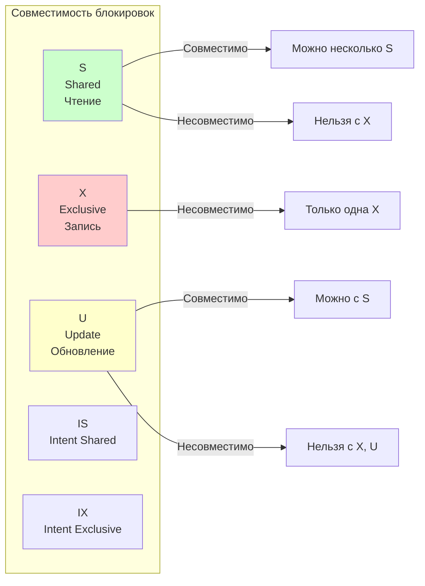

**7.3. Свойства блокировок**
*   **Совместимость:** Некоторые блокировки могут сосуществовать на одном ресурсе (например, несколько S-блокировок), другие — нет (X-блокировка несовместима ни с чем).
*   **Длительность:** Блокировки удерживаются до конца транзакции (COMMIT/ROLLBACK) или до момента, когда они больше не нужны (зависит от уровня изоляции).
*   **Автоматическое управление:** СУБД автоматически устанавливает и снимает блокировки в зависимости от выполняемых операций.

**7.4. Иерархия блокировок**
Блокировки могут устанавливаться на разных уровнях иерархии ресурсов:
*   **База данных (Database):** Блокировка всей базы данных (редко используется).
*   **Таблица (Table):** Блокировка всей таблицы.
*   **Страница (Page/Extent):** Блокировка страницы данных (обычно 8 КБ).
*   **Строка (Row/RID):** Блокировка отдельной строки (самый гранулярный уровень).
*   **Ключ (Key):** Блокировка ключа в индексе.

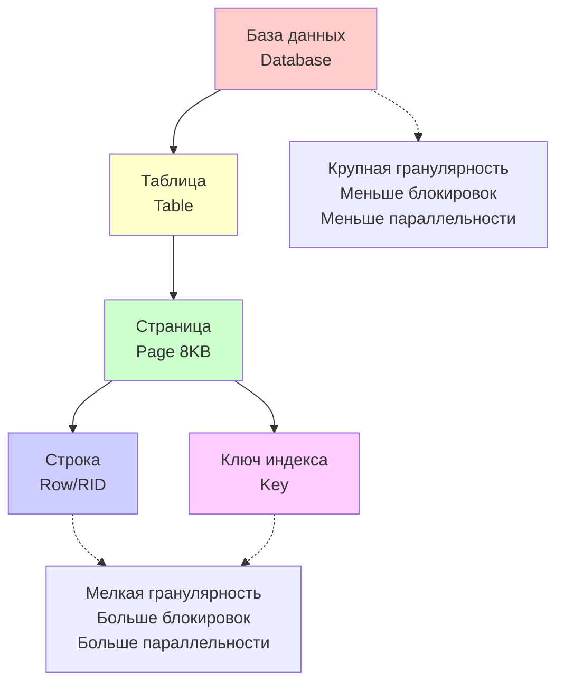

**7.5. Гранулярность блокировок**
*   **Крупная гранулярность (Coarse-grained):** Блокируем большие объекты (таблицы, страницы). Меньше блокировок в памяти, но снижается параллельность (много транзакций ждут).
*   **Мелкая гранулярность (Fine-grained):** Блокируем маленькие объекты (строки). Выше параллельность, но больше блокировок в памяти.
*   **Эскалация блокировок (Lock Escalation):** Если блокировок строк слишком много (например, больше порога в 5000), СУБД автоматически заменяет их одной блокировкой таблицы. Экономит память, но снижает параллельность. Можно отключить эскалацию для критичных таблиц.

**7.6. Алгоритмы обнаружения взаимоблокировок (Deadlock Detection)**
*   **Граф ожидания (Wait-for Graph):** СУБД строит граф, где узлы — транзакции, а ребра — отношения "транзакция А ждет ресурс, занятый транзакцией Б".
*   **Поиск циклов:** Периодически (например, каждые 5 секунд) СУБД проверяет граф на наличие циклов. Цикл = взаимоблокировка.
*   **Выбор жертвы:** Из транзакций в цикле выбирается жертва по критериям:
    - Меньше всего изменений (дешевле откатить)
    - Меньше времени работы
    - Меньше приоритет (если есть система приоритетов)
*   **Откат жертвы:** Выбранная транзакция получает ошибку "deadlock victim" и откатывается (ROLLBACK), освобождая свои блокировки.
*   **Timeout:** Альтернативный метод — каждая транзакция имеет таймаут ожидания блокировки. Если ждет слишком долго, откатывается автоматически.

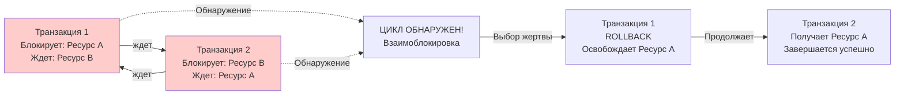

**7.7. Проблемы блокировок**
*   **Блокировки чтения (Read Locks):** При уровне Repeatable Read блокировки чтения удерживаются до конца транзакции, что может привести к большому количеству ожидающих транзакций.
*   **Блокировки обновления:** Долгие транзакции удерживают блокировки долго, заставляя других ждать.
*   **Живые блокировки (Live Locks):** Транзакция постоянно пытается получить блокировку, но не может, потому что другие транзакции постоянно ее опережают (редко, но возможно).

---

### Блок 8: Журнализация (Logging)

Как обеспечить надежность (Durability) и откат изменений.

**8.1. Журнал транзакций (Transaction Log / WAL)**
*   **Write-Ahead Logging (WAL):** Принцип "сначала журнал, потом данные". Сначала пишем изменение в журнал на диск, только потом меняем данные в файле БД.
*   **Зачем нужен журнал:**
    - Восстановление после сбоя (Recovery): можно повторить все зафиксированные транзакции
    - Откат транзакций (Rollback): можно отменить незавершенные транзакции
    - Репликация: журнал можно передать на другой сервер для синхронизации
*   **Гарантия надежности:** Если изменение записано в журнал на диск, оно не потеряется даже при сбое.

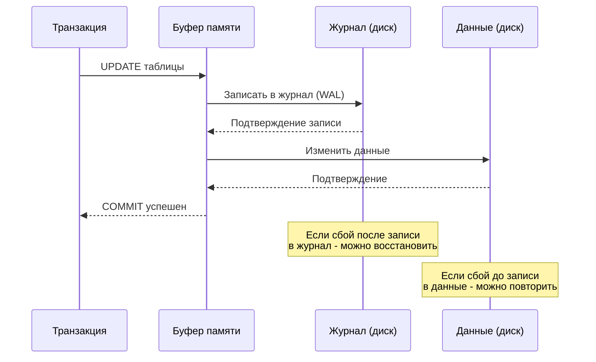

**8.2. Операции журнала транзакций**
*   **BEGIN TRANSACTION:** Запись начала транзакции
*   **INSERT/UPDATE/DELETE:** Запись каждого изменения (старое значение, новое значение)
*   **COMMIT:** Запись фиксации транзакции
*   **ROLLBACK:** Запись отката транзакции (или использование журнала для отката)
*   **CHECKPOINT:** Точка синхронизации: все изменения из буферов записываются на диск

**8.3. Логическая архитектура журнала**
*   **Последовательность записей:** Журнал — это последовательный файл записей
*   **LSN (Log Sequence Number):** Уникальный порядковый номер каждой записи в журнале
*   **Активная часть журнала:** Записи незавершенных транзакций (MinLSN до текущего LSN)
*   **Неактивная часть:** Записи завершенных транзакций, которые уже применены к данным

**8.4. Физическая архитектура журнала**
*   **Файлы журнала:** Один или несколько файлов на диске
*   **Циклическое использование:** Журнал может быть циклическим (когда неактивная часть перезаписывается)
*   **Автоматический рост:** Журнал может автоматически увеличиваться при необходимости
*   **Разделение на виртуальные логические файлы (VLF):** Для управления и оптимизации

**8.5. Модели восстановления (Recovery Models)**
Определяют, как много информации записывается в журнал и можно ли восстановить БД на конкретный момент времени.

**8.5.1. Full Recovery Model (Полная модель восстановления):**
*   **Характеристики:** Записываются все операции (INSERT, UPDATE, DELETE, даже массовые)
*   **Возможности:** Можно восстановить БД на любую секунду в прошлом (Point-in-Time Recovery)
*   **Требования:** Нужно регулярно делать бэкапы журнала (Transaction Log Backups), иначе журнал будет расти бесконечно
*   **Применение:** Критичные БД, где важна возможность восстановления на конкретный момент

**8.5.2. Simple Recovery Model (Простая модель восстановления):**
*   **Характеристики:** Журнал автоматически очищается после CHECKPOINT (неактивные записи удаляются)
*   **Возможности:** Можно восстановить БД только на момент последнего полного бэкапа (Full Backup)
*   **Ограничения:** Нет возможности восстановления на конкретный момент времени, нет бэкапов журнала
*   **Применение:** Тестовые БД, БД разработки, где потеря данных не критична

**8.5.3. Bulk-Logged Recovery Model (Модель массового логирования):**
*   **Характеристики:** Обычные операции логируются полностью, массовые операции (BULK INSERT, CREATE INDEX) логируются минимально
*   **Возможности:** Можно восстановить на конкретный момент, но только если не было массовых операций
*   **Компромисс:** Меньше места в журнале, но ограниченные возможности восстановления
*   **Применение:** Периодические массовые загрузки данных

**8.6. Процесс восстановления (Recovery Process)**
*   **Анализ (Analysis):** Определение активных транзакций на момент сбоя
*   **Повтор (Redo / Roll Forward):** Применение всех зафиксированных транзакций из журнала к данным
*   **Откат (Undo / Roll Back):** Откат всех незафиксированных транзакций
*   **Результат:** БД в согласованном состоянии на момент последнего CHECKPOINT или на указанный момент времени

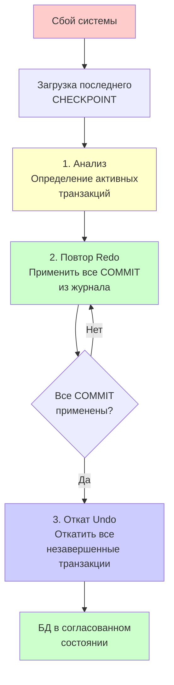

**8.7. Метаданные журнала**
*   Информация о структуре журнала, активных транзакциях, точках восстановления
*   Хранятся в системных таблицах и используются процессом восстановления
*   Позволяют определить, какие транзакции нужно применить или откатить

---

### Блок 9: Безопасность и Аудит

**9.1. Участники (Principals)**
*   *Logins:* Уровень сервера (войти в SQL Server).
*   *Users:* Уровень базы данных (право работать с конкретной БД).
*   *Roles:* Группы прав (например, `db_owner`, `db_datareader`).

**9.2. Разрешения (Permissions)**
*   `GRANT`: Дать право (например, SELECT).
*   `DENY`: Явно запретить (сильнее, чем GRANT).
*   `REVOKE`: Отменить выданное право.

**9.3. Цепочки владения**
Если у View и у Таблицы один владелец, то при обращении к View права на Таблицу не проверяются. Это удобно, но может быть дырой в безопасности.

---

### Блок 10: MPP системы и Hadoop

Работа с большими данными (Big Data).

**10.1. MPP (Massively Parallel Processing)**
*   **Архитектура:** Shared Nothing (у каждого узла свой процессор и диск). Данные разбиты на куски (шарды) и лежат на разных серверах.
*   **Vertica:** Пример MPP.
    *   *Колоночное хранение:* Данные хранятся не по строкам, а по колонкам. Это супер быстро для аналитики (SELECT sum(price)...), так как читаем только нужную колонку. Сжатие данных очень эффективно.
    *   *Проекции:* Аналог материализованных представлений/индексов, хранят данные в отсортированном виде.

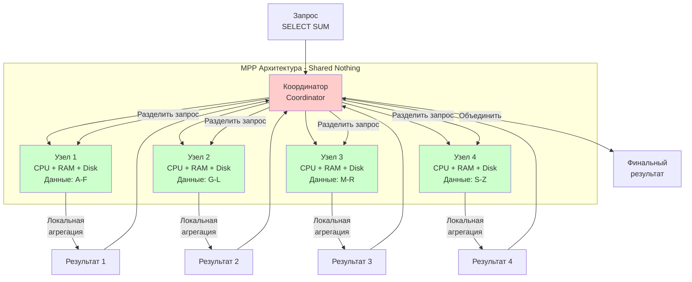

**10.2. Hadoop**
*   **HDFS:** Распределенная файловая система. Файлы бьются на блоки (например, по 128 Мб) и разбрасываются по узлам.
*   **NameNode:** Главный сервер, знает, где лежат какие блоки.
*   **DataNode:** Рабочие серверы, хранят сами данные.
*   **MapReduce:** Модель вычислений.
    *   *Map:* Параллельная обработка данных на узлах.
    *   *Reduce:* Сбор и агрегация результатов.

---

### Блок 11: In-Memory базы данных и Redis

Для сверхбыстрой работы, когда диск — это узкое место.

**11.1. In-Memory DB**
Все данные живут в оперативной памяти (RAM).
*   *Плюсы:* Нет операций ввода-вывода (IO), нет сложных буферов, безумная скорость.
*   *Минусы:* Данные пропадают при выключении (нужны снимки/логи на диск), память дорогая и ограниченная.

**11.2. Redis**
Хранилище "Ключ-Значение".
*   *Типы данных:* Строки, Списки (Lists), Множества (Sets), Хеши (Hashes), Sorted Sets.
*   *Персистентность (сохранение):*
    *   RDB (Snapshot): Снимок памяти раз в N минут.
    *   AOF (Append Only File): Лог каждой команды (надежнее, но медленнее).
*   *Применение:* Кэширование, сессии пользователей, счетчики, очереди, таблицы лидеров.

---

### Блок 12: Язык SQL (Инструкции)

SQL (Structured Query Language) — стандартизированный язык для работы с реляционными БД.

**12.1. DDL (Data Definition Language - Язык определения данных)**
Инструкции для создания и изменения структуры БД.

**12.1.1. Работа с таблицами:**
*   `CREATE TABLE`: Создать таблицу с указанием колонок, типов данных, ограничений.
    *   Пример: `CREATE TABLE Students (ID INT PRIMARY KEY, Name VARCHAR(100), Age INT)`
*   `ALTER TABLE`: Изменить структуру существующей таблицы.
    *   Добавить колонку: `ALTER TABLE Students ADD Email VARCHAR(255)`
    *   Удалить колонку: `ALTER TABLE Students DROP COLUMN Age`
    *   Изменить тип колонки: `ALTER TABLE Students ALTER COLUMN Name VARCHAR(200)`
    *   Добавить ограничение: `ALTER TABLE Students ADD CONSTRAINT CHK_Age CHECK (Age > 0)`
*   `DROP TABLE`: Удалить таблицу полностью (все данные теряются).
*   `TRUNCATE TABLE`: Удалить все данные из таблицы, но сохранить структуру (быстрее, чем DELETE).

**12.1.2. Работа с ограничениями (Constraints):**
*   **PRIMARY KEY:** Первичный ключ (уникальность + NOT NULL).
*   **FOREIGN KEY:** Внешний ключ (ссылочная целостность).
*   **UNIQUE:** Уникальность значений (может быть NULL).
*   **NOT NULL:** Запрет на пустые значения.
*   **CHECK:** Проверка условия (например, Age > 0).
*   **DEFAULT:** Значение по умолчанию.

**12.1.3. Работа с индексами:**
*   `CREATE INDEX`: Создать индекс для ускорения поиска.
*   `DROP INDEX`: Удалить индекс.

**12.1.4. Работа с представлениями (Views):**
*   `CREATE VIEW`: Создать виртуальную таблицу (сохраненный запрос).
*   `ALTER VIEW`: Изменить представление.
*   `DROP VIEW`: Удалить представление.

**12.2. DML (Data Manipulation Language - Язык манипуляции данными)**
Инструкции для работы с данными в таблицах.

**12.2.1. SELECT - Выборка данных:**
*   Базовый синтаксис: `SELECT колонки FROM таблица WHERE условие`
*   `SELECT *`: Выбрать все колонки.
*   `SELECT DISTINCT`: Убрать дубликаты строк.
*   `ORDER BY`: Сортировка результатов.
*   `GROUP BY`: Группировка для агрегатных функций.
*   `HAVING`: Фильтрация групп (аналог WHERE для групп).
*   `LIMIT / TOP`: Ограничение количества возвращаемых строк.

**12.2.2. INSERT - Вставка данных:**
*   `INSERT INTO table VALUES (value1, value2, ...)`: Вставка одной строки со всеми значениями.
*   `INSERT INTO table (col1, col2) VALUES (val1, val2)`: Вставка с указанием колонок.
*   `INSERT INTO table SELECT ...`: Вставка результатов запроса (множественная вставка).

**12.2.3. UPDATE - Обновление данных:**
*   `UPDATE table SET col1 = value1, col2 = value2 WHERE condition`: Обновить строки, удовлетворяющие условию.
*   Важно: всегда использовать WHERE, иначе обновятся все строки!

**12.2.4. DELETE - Удаление данных:**
*   `DELETE FROM table WHERE condition`: Удалить строки, удовлетворяющие условию.
*   Важно: всегда использовать WHERE, иначе удалятся все строки!
*   Отличие от TRUNCATE: DELETE можно откатить, логируется каждая строка, медленнее.

**12.3. Операции над множествами (Set Operations)**
Объединение результатов нескольких SELECT-запросов.

**12.3.1. UNION:**
*   Объединяет результаты двух запросов, удаляя дубликаты.
*   Оба запроса должны возвращать одинаковое количество колонок с совместимыми типами.
*   Пример: `SELECT Name FROM Students UNION SELECT Name FROM Teachers`

**12.3.2. UNION ALL:**
*   Объединяет результаты с сохранением дубликатов.
*   Быстрее UNION, так как не нужно проверять дубликаты.

**12.3.3. INTERSECT:**
*   Возвращает строки, которые есть в результатах обоих запросов (пересечение).
*   Пример: найти студентов, которые и учатся, и работают.

**12.3.4. EXCEPT (или MINUS в Oracle):**
*   Возвращает строки из первого запроса, которых нет во втором (вычитание).
*   Пример: найти студентов, которые не работают.

**12.4. Joins (Соединения таблиц)**
Объединение данных из нескольких таблиц.

**12.4.1. INNER JOIN (Внутреннее соединение):**
*   Возвращает только строки, для которых есть совпадение в обеих таблицах.
*   Синтаксис: `SELECT * FROM table1 INNER JOIN table2 ON table1.id = table2.id`
*   Можно писать просто `JOIN` (INNER по умолчанию).

**12.4.2. LEFT JOIN (LEFT OUTER JOIN):**
*   Возвращает все строки из левой таблицы + совпадающие из правой.
*   Если совпадения нет, колонки правой таблицы заполняются NULL.
*   Пример: все студенты, даже если у них нет заказов.

**12.4.3. RIGHT JOIN (RIGHT OUTER JOIN):**
*   Возвращает все строки из правой таблицы + совпадающие из левой.
*   Если совпадения нет, колонки левой таблицы заполняются NULL.

**12.4.4. FULL JOIN (FULL OUTER JOIN):**
*   Возвращает все строки из обеих таблиц.
*   Если совпадения нет, колонки отсутствующей таблицы заполняются NULL.

**12.4.5. CROSS JOIN (Декартово произведение):**
*   Каждая строка первой таблицы соединяется с каждой строкой второй.
*   Результат: количество строк = количество строк в первой × количество строк во второй.
*   Обычно используется редко, может быть случайным (если забыли указать условие JOIN).

**12.4.6. Сложные JOIN:**
*   Можно соединять несколько таблиц: `FROM A JOIN B ON ... JOIN C ON ...`
*   Условия соединения могут быть сложными (несколько колонок, неравенства).

**12.5. DCL (Data Control Language - Язык управления данными)**
Инструкции для управления доступом.

**12.5.1. GRANT:**
*   Дать права пользователю или роли.
*   Пример: `GRANT SELECT, INSERT ON Students TO user1`

**12.5.2. REVOKE:**
*   Отозвать ранее выданные права.
*   Пример: `REVOKE INSERT ON Students FROM user1`

**12.5.3. DENY:**
*   Явно запретить право (сильнее, чем отсутствие GRANT).
*   Пример: `DENY DELETE ON Students TO user1`

**12.6. TCL (Transaction Control Language - Язык управления транзакциями)**
Инструкции для управления транзакциями.

**12.6.1. BEGIN TRANSACTION (или START TRANSACTION):**
*   Начать транзакцию.

**12.6.2. COMMIT:**
*   Зафиксировать изменения (сохранить).

**12.6.3. ROLLBACK:**
*   Откатить изменения (отменить все изменения в транзакции).

**12.6.4. SAVEPOINT:**
*   Создать точку сохранения внутри транзакции.
*   `ROLLBACK TO SAVEPOINT name`: Откатиться к точке сохранения.

---

### Блок 13: Объекты базы данных (Программируемые)

**13.1. Функции (UDF - User Defined Functions)**
Функции — это объекты БД, которые принимают параметры и возвращают результат. Их можно использовать в SQL-запросах.

**13.1.1. Классификация функций по типу возвращаемого значения:**
*   **Скалярные функции (Scalar Functions):** Возвращают одно значение (число, строку, дату). Можно использовать в SELECT, WHERE, HAVING, ORDER BY.
    *   Пример: `SELECT dbo.CalculateAge(BirthDate) FROM Users`
    *   Всегда вызываются с префиксом схемы: `dbo.FunctionName()`
*   **Табличные функции (Table-Valued Functions):** Возвращают таблицу (набор строк). Можно использовать в FROM как обычную таблицу.
    *   Пример: `SELECT * FROM dbo.GetUsersByCity('Moscow')`
    *   Могут быть инлайн (inline) — просто SELECT, или многооператорные (multi-statement) — с логикой.

**13.1.2. Классификация функций по детерминированности:**
*   **Детерминированные (Deterministic):** При одинаковых входных параметрах всегда возвращают одинаковый результат. Можно использовать в индексах и материализованных представлениях.
    *   Пример: математические функции (ABS, ROUND)
*   **Недетерминированные (Non-Deterministic):** Могут возвращать разные результаты при одинаковых параметрах.
    *   Пример: функции с датой/временем (GETDATE()), функции со случайными числами (RAND())

**13.1.3. Классификация функций по доступу к данным:**
*   **Функции без доступа к данным:** Не обращаются к таблицам БД, только работают с параметрами.
*   **Функции с доступом к данным:** Могут читать данные из таблиц (SELECT внутри функции).

**13.1.4. Создание и использование функций:**
*   Создание: `CREATE FUNCTION FunctionName(@param TYPE) RETURNS TYPE AS BEGIN ... END`
*   Изменение: `ALTER FUNCTION`
*   Удаление: `DROP FUNCTION`
*   Ограничения: Функции не могут изменять данные (нет INSERT/UPDATE/DELETE), не могут управлять транзакциями, не могут вызывать хранимые процедуры (в некоторых СУБД).

**13.2. Хранимые процедуры (Stored Procedures)**
Набор команд SQL, сохраненный в БД и выполняемый как единое целое.

**13.2.1. Особенности процедур:**
*   Могут иметь входные параметры (IN) и выходные параметры (OUT).
*   Могут возвращать результирующие наборы (SELECT внутри процедуры).
*   Компилируются и кэшируются (работают быстрее, чем динамический SQL).
*   Могут изменять данные (INSERT, UPDATE, DELETE).
*   Могут управлять транзакциями (BEGIN TRANSACTION, COMMIT, ROLLBACK).
*   Могут вызывать другие процедуры и функции.

**13.2.2. Преимущества процедур:**
*   Производительность: компиляция и кэширование плана выполнения.
*   Безопасность: можно дать права на выполнение процедуры без прав на таблицы.
*   Инкапсуляция логики: бизнес-логика хранится в БД, а не в приложении.
*   Снижение сетевого трафика: одна команда `EXEC ProcedureName` вместо множества SQL-запросов.

**13.2.3. Создание и выполнение:**
*   Создание: `CREATE PROCEDURE ProcedureName @param TYPE AS BEGIN ... END`
*   Выполнение: `EXEC ProcedureName @param = value` или `EXECUTE ProcedureName value`
*   Изменение: `ALTER PROCEDURE`
*   Удаление: `DROP PROCEDURE`

**13.3. Триггеры (Triggers)**
Процедуры, которые срабатывают *автоматически* при определенных событиях в БД.

**13.3.1. Типы триггеров по времени срабатывания:**
*   **AFTER (FOR):** Срабатывают *после* выполнения действия (INSERT, UPDATE, DELETE). Действие уже выполнено, данные уже изменены.
    *   Используются для: логирования, проверок после изменения, обновления связанных данных.
*   **INSTEAD OF:** Срабатывают *вместо* действия. Само действие (INSERT/UPDATE/DELETE) не выполняется, выполняется только код триггера.
    *   Часто используются на представлениях (Views), которые нельзя напрямую обновлять.
    *   Позволяют реализовать кастомную логику обновления.

**13.3.2. Типы триггеров по уровню:**
*   **Триггеры уровня строки (Row-level):** Срабатывают для каждой измененной строки. В SQL Server это реализуется через специальные таблицы inserted и deleted.
*   **Триггеры уровня оператора (Statement-level):** Срабатывают один раз для всей операции, независимо от количества затронутых строк.

**13.3.3. Специальные таблицы в триггерах:**
*   **inserted:** Содержит новые значения (для INSERT и UPDATE).
*   **deleted:** Содержит старые значения (для UPDATE и DELETE).
*   Эти таблицы доступны только внутри триггера.

**13.3.4. Ограничения триггеров:**
*   Не могут возвращать данные пользователю (нет SELECT для вывода).
*   Не могут управлять транзакциями напрямую (но могут вызывать ROLLBACK).
*   Могут привести к каскадным срабатываниям (триггер вызывает изменение, которое вызывает другой триггер).

**13.4. Курсоры (Cursors)**
Механизм для обработки строк *по одной* в цикле, как в процедурных языках программирования.

**13.4.1. Зачем нужны курсоры:**
*   Когда нужно обработать каждую строку результата запроса отдельно.
*   Когда логика обработки слишком сложна для одного SQL-запроса.
*   Когда нужно выполнить разные действия для разных строк.

**13.4.2. Типы курсоров:**
*   **Статические (Static):** Снимок данных на момент открытия. Изменения в данных не видны.
*   **Динамические (Dynamic):** Видят все изменения в реальном времени. Самые ресурсоемкие.
*   **Набор ключей (Keyset):** Видят изменения существующих строк, но не видят новые строки.
*   **Быстрые (Fast Forward):** Только для чтения вперед, самый быстрый тип.

**13.4.3. Операции с курсорами:**
*   `DECLARE CURSOR`: Объявление курсора с SELECT-запросом.
*   `OPEN`: Открытие курсора, выполнение запроса.
*   `FETCH`: Получение следующей строки.
*   `CLOSE`: Закрытие курсора (память освобождается).
*   `DEALLOCATE`: Полное удаление курсора из памяти.

**13.4.4. Недостатки курсоров:**
*   **Медленные:** Обработка по одной строке намного медленнее, чем работа с множествами.
*   **Блокировки:** Держат блокировки дольше, снижая параллельность.
*   **Память:** Занимают память на время работы.
*   **Рекомендация:** Избегать курсоров, использовать операции над множествами (SET-based operations) везде, где возможно.

---

### Блок 14: Оптимизация запроса

**14.1. Индексы**
Индекс — это дополнительная структура данных, которая ускоряет поиск данных в таблице.

**14.1.1. Классификация индексов по структуре хранения:**
*   **Кластерный индекс (Clustered Index):** Сами данные таблицы физически отсортированы на диске по ключу индекса. Таблица может иметь только один кластерный индекс (обычно это Primary Key). Данные хранятся в листовых узлах индекса.
    *   Преимущества: очень быстрый поиск по ключу, быстрая сортировка по ключу.
    *   Недостатки: медленная вставка в середину (нужно перестраивать порядок), один на таблицу.
*   **Некластерный индекс (Non-Clustered Index):** Отдельная структура данных, где хранится ключ индекса + указатель (RID или кластерный ключ) на строку данных. Данные не переупорядочены. На таблицу может быть много некластерных индексов.
    *   Преимущества: можно создать много индексов, быстрая вставка.
    *   Недостатки: дополнительное место на диске, при поиске нужно два обращения (сначала индекс, потом данные).

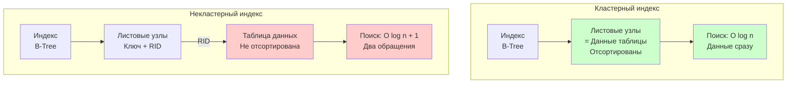

**14.1.2. Классификация индексов по структуре данных:**
*   **B-Tree индекс (B-дерево):** Классическая структура для большинства индексов. Сбалансированное дерево, обеспечивает логарифмическое время поиска. Подходит для операций сравнения (=, <, >, BETWEEN).
*   **Хеш-индекс:** Использует хеш-функцию для быстрого поиска по точному совпадению. Очень быстрый для =, но не поддерживает диапазонные запросы.
*   **Bitmap индекс:** Для колонок с небольшим количеством уникальных значений (например, пол: М/Ж). Эффективен для аналитических запросов.
*   **Полнотекстовый индекс (Full-Text):** Для поиска по тексту, поддерживает морфологию и ранжирование результатов.

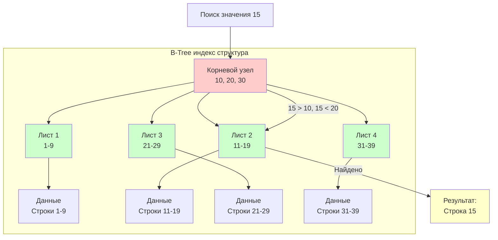

**14.1.3. Классификация индексов по составу:**
*   **Простой индекс:** Индекс по одной колонке.
*   **Составной индекс (Composite):** Индекс по нескольким колонкам. Порядок колонок важен! Запрос должен использовать колонки слева направо (правило "левого префикса").
    *   Пример: индекс на (LastName, FirstName) будет использован для `WHERE LastName = 'Ivanov'`, но не для `WHERE FirstName = 'Ivan'`.

**14.1.4. Классификация индексов по уникальности:**
*   **Уникальный индекс:** Гарантирует, что значения в индексе уникальны. Primary Key автоматически создает уникальный кластерный индекс.
*   **Неуникальный индекс:** Позволяет дубликаты значений.

**14.1.5. Классификация индексов по покрытию запроса:**
*   **Покрывающий индекс (Covering Index):** Индекс содержит все колонки, необходимые для запроса. Запрос может быть выполнен только по индексу, без обращения к таблице данных. Очень быстрый!
    *   Пример: индекс на (CustomerID, OrderDate, Total) покрывает запрос `SELECT OrderDate, Total WHERE CustomerID = 123`.

**14.1.6. Специальные типы индексов:**
*   **Фильтрованный индекс (Filtered Index):** Индекс только на подмножестве строк (с условием WHERE). Экономит место и ускоряет запросы к этому подмножеству.
    *   Пример: индекс только на активных пользователях `WHERE Status = 'Active'`.
*   **Индекс с включенными колонками (Included Columns):** В некластерный индекс можно включить дополнительные колонки, которые не участвуют в сортировке, но нужны для покрытия запроса.
*   **Партиционированный индекс:** Индекс, разбитый по партициям таблицы.

**14.1.7. Когда использовать индексы:**
*   **Нужны индексы:** Частые поиски по колонке, частые JOIN по колонке, частые сортировки (ORDER BY), внешние ключи.
*   **Не нужны индексы:** Редко используемые колонки, колонки с частыми изменениями (замедляют INSERT/UPDATE), очень маленькие таблицы (сканирование быстрее).

**14.1.8. Обслуживание индексов:**
*   **Фрагментация:** Со временем индексы фрагментируются (данные разбросаны по диску), что замедляет работу.
*   **Перестроение (REBUILD):** Полное пересоздание индекса, устраняет фрагментацию. Блокирует таблицу.
*   **Реорганизация (REORGANIZE):** Мягкая дефрагментация, не блокирует таблицу полностью.

**14.2. Партиционирование (Partitioning)**
Разбиение огромной таблицы на логические части (партиции) для улучшения производительности и управляемости.

**14.2.1. Типы партиционирования:**
*   **Партиционирование по диапазону (Range Partitioning):** Данные разбиваются по диапазонам значений (например, по годам: 2020, 2021, 2022).
    *   Пример: `PARTITION BY RANGE (OrderDate)`
*   **Партиционирование по списку (List Partitioning):** Данные разбиваются по списку значений (например, по регионам: Москва, СПб, другие).
*   **Партиционирование по хешу (Hash Partitioning):** Данные распределяются по партициям с помощью хеш-функции от ключа. Обеспечивает равномерное распределение.

**14.2.2. Преимущества партиционирования:**
*   **Производительность запросов:** Запросы могут обрабатывать только нужные партиции (partition pruning), а не всю таблицу.
*   **Управление данными:** Легко удалять старые данные (удалить партицию), легко добавлять новые (добавить партицию).
*   **Параллелизм:** Разные партиции можно обрабатывать параллельно.
*   **Индексы:** Можно создавать индексы на отдельных партициях.

**14.2.3. Стратегия партиционирования:**
*   Выбрать колонку партиционирования (часто используется в WHERE).
*   Определить границы партиций.
*   Настроить автоматическое добавление новых партиций (например, каждый месяц).

**14.3. Сегментирование (Segmentation)**
В MPP системах (Massively Parallel Processing) — распределение данных по узлам кластера для параллельной обработки.

**14.3.1. Методы сегментирования:**
*   **По хешу (Hash Segmentation):** Данные распределяются по узлам с помощью хеш-функции от ключа. Обеспечивает равномерное распределение.
*   **По диапазону (Range Segmentation):** Данные распределяются по диапазонам значений.
*   **Круговая схема (Round-Robin):** Данные распределяются по очереди на каждый узел.
*   **Репликация (Replication):** Копии данных хранятся на всех узлах (для маленьких справочных таблиц).

**14.3.2. Цели сегментирования:**
*   Равномерное распределение нагрузки по узлам.
*   Локальность данных (данные обрабатываются на том же узле, где хранятся).
*   Параллельная обработка запросов (каждый узел обрабатывает свою часть данных).

---

### Блок 15: План запроса

Как СУБД выполняет ваш SQL.

**15.1. Этапы**
1.  **Парсинг:** Проверка синтаксиса.
2.  **Связывание (Binding):** Проверка, существуют ли такие таблицы и колонки.
3.  **Оптимизация:** Самый важный этап. Оптимизатор на основе *статистики* (сколько строк, какие данные) строит несколько вариантов планов и выбирает самый дешевый (по CPU и I/O).
4.  **Выполнение (Execution):** Движок выполняет план.

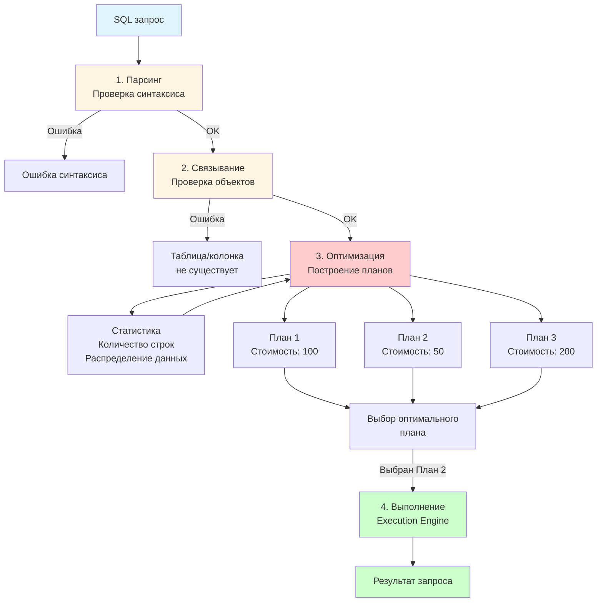

**15.2. Чтение плана (EXPLAIN)**
*   **Scan:** Проход по таблице.
    *   `Table Scan` / `Seq Scan`: Плохо, читаем всё подряд.
    *   `Index Scan` / `Index Seek`: Хорошо, ищем по дереву индекса.
*   **Join:** Алгоритмы соединения.
    *   `Nested Loops`: Хорошо для малых данных.
    *   `Hash Join`: Хорошо для больших несортированных данных (строит хеш-таблицу в памяти).
    *   `Merge Join`: Лучший вариант для больших *отсортированных* данных.

**15.3. Подзапросы (Subqueries)**
Подзапрос — это SELECT-запрос, вложенный в другой запрос.

**15.3.1. Коррелированные подзапросы (Correlated Subqueries):**
*   **Определение:** Подзапрос, который ссылается на колонки внешнего запроса. Выполняется для *каждой* строки внешнего запроса.
*   **Пример:** 
    ```sql
    SELECT * FROM Orders o
    WHERE o.Total > (SELECT AVG(Total) FROM Orders 
                     WHERE CustomerID = o.CustomerID)
    ```
    Для каждой строки Orders подзапрос вычисляет средний чек этого клиента.
*   **Характеристики:**
    - Медленные, так как выполняются многократно (для каждой строки).
    - Могут быть заменены на JOIN для улучшения производительности.
    - Полезны, когда логику сложно выразить через JOIN.
*   **Использование:** В WHERE, SELECT, HAVING.

**15.3.2. Некоррелированные подзапросы (Non-Correlated Subqueries):**
*   **Определение:** Подзапрос, который не зависит от внешнего запроса. Выполняется один раз, результат кэшируется и используется во внешнем запросе.
*   **Пример:**
    ```sql
    SELECT * FROM Orders
    WHERE CustomerID IN (SELECT CustomerID FROM Customers 
                         WHERE City = 'Moscow')
    ```
    Подзапрос выполняется один раз, возвращает список ID клиентов из Москвы.
*   **Характеристики:**
    - Быстрые, выполняются один раз.
    - Могут быть заменены на JOIN, но часто читабельнее как подзапросы.
*   **Использование:** В WHERE (с IN, EXISTS, сравнениями), SELECT, FROM (как производная таблица).

**15.3.3. Типы подзапросов по возвращаемому значению:**
*   **Скалярный подзапрос:** Возвращает одно значение (одна строка, одна колонка). Используется в сравнениях (=, <, >).
*   **Подзапрос с одной колонкой:** Возвращает множество значений одной колонки. Используется с IN, NOT IN, ANY, ALL.
*   **Табличный подзапрос:** Возвращает таблицу (множество строк и колонок). Используется в FROM как производная таблица или с EXISTS.

**15.3.4. Операторы для подзапросов:**
*   **IN / NOT IN:** Проверка принадлежности множеству значений.
*   **EXISTS / NOT EXISTS:** Проверка существования хотя бы одной строки (часто используется с коррелированными подзапросами, эффективнее IN).
*   **ANY / SOME:** Хотя бы одно значение удовлетворяет условию.
*   **ALL:** Все значения удовлетворяют условию.
*   **Сравнения (=, <, >, и т.д.):** Для скалярных подзапросов.

**15.3.5. Оптимизация подзапросов:**
*   Замена коррелированных подзапросов на JOIN (если возможно).
*   Использование EXISTS вместо IN для больших наборов данных.
*   Использование производных таблиц (в FROM) вместо подзапросов в WHERE, если это улучшает план выполнения.

---

## БЛОКИ ИЗ СЕМИНАРОВ

### Блок С1: SQL DDL (Семинар 1)

**С1.1. Создание таблиц (CREATE TABLE)**
*   Базовый синтаксис: `CREATE TABLE TableName (ColumnName DataType [Constraints])`
*   Типы данных: INT, VARCHAR(n), CHAR(n), DATE, DATETIME, DECIMAL(p,s), FLOAT, BIT, TEXT, BLOB
*   Ограничения при создании:
    - `PRIMARY KEY`: Первичный ключ (можно указать в определении колонки или отдельно)
    - `FOREIGN KEY REFERENCES Table(Column)`: Внешний ключ
    - `UNIQUE`: Уникальность
    - `NOT NULL`: Запрет NULL
    - `CHECK (condition)`: Проверка условия
    - `DEFAULT value`: Значение по умолчанию
    - `IDENTITY(1,1)`: Автоинкремент (SQL Server) / `AUTO_INCREMENT` (MySQL)

**С1.2. Изменение таблиц (ALTER TABLE)**
*   Добавление колонки: `ALTER TABLE TableName ADD ColumnName DataType`
*   Удаление колонки: `ALTER TABLE TableName DROP COLUMN ColumnName`
*   Изменение колонки: `ALTER TABLE TableName ALTER COLUMN ColumnName NewDataType`
*   Добавление ограничения: `ALTER TABLE TableName ADD CONSTRAINT ConstraintName ...`
*   Удаление ограничения: `ALTER TABLE TableName DROP CONSTRAINT ConstraintName`

**С1.3. Удаление таблиц (DROP TABLE)**
*   `DROP TABLE TableName`: Удаляет таблицу и все данные
*   Если есть внешние ключи, нужно сначала удалить зависимые таблицы или использовать `CASCADE`

**С1.4. Работа с индексами в DDL**
*   `CREATE INDEX IndexName ON TableName (ColumnName)`: Создать индекс
*   `CREATE UNIQUE INDEX`: Создать уникальный индекс
*   `CREATE CLUSTERED INDEX`: Создать кластерный индекс (SQL Server)
*   `DROP INDEX IndexName ON TableName`: Удалить индекс

**С1.5. Работа с представлениями (Views)**
*   `CREATE VIEW ViewName AS SELECT ...`: Создать представление (виртуальную таблицу)
*   `ALTER VIEW ViewName AS SELECT ...`: Изменить представление
*   `DROP VIEW ViewName`: Удалить представление
*   Представления не хранят данные, только определение запроса

---

### Блок С2: SQL DML (Семинар 2)

**С2.1. SELECT - Детальный разбор**
*   Базовые возможности:
    - Выбор колонок: `SELECT col1, col2, col3`
    - Псевдонимы: `SELECT col1 AS alias, col2 alias2`
    - Вычисления: `SELECT Price * Quantity AS Total`
    - Константы: `SELECT 'Constant' AS Col`
*   WHERE - условия фильтрации:
    - Операторы сравнения: `=, <>, <, >, <=, >=`
    - Логические операторы: `AND, OR, NOT`
    - Операторы: `IN, NOT IN, BETWEEN, LIKE, IS NULL, IS NOT NULL`
    - `LIKE` с шаблонами: `%` (любые символы), `_` (один символ)
*   ORDER BY - сортировка:
    - `ORDER BY col1 ASC, col2 DESC`
    - Можно сортировать по номеру колонки: `ORDER BY 1, 2`
*   LIMIT / TOP - ограничение результатов:
    - `SELECT TOP 10 * FROM Table` (SQL Server)
    - `SELECT * FROM Table LIMIT 10` (MySQL, PostgreSQL)

**С2.2. INSERT - Вставка данных**
*   Вставка одной строки: `INSERT INTO Table (col1, col2) VALUES (val1, val2)`
*   Вставка нескольких строк: `INSERT INTO Table VALUES (val1, val2), (val3, val4), ...`
*   Вставка из запроса: `INSERT INTO Table SELECT ... FROM OtherTable`
*   Вставка с DEFAULT: можно не указывать колонки, для которых есть DEFAULT
*   Вставка в определенные колонки: указывать только нужные колонки

**С2.3. UPDATE - Обновление данных**
*   Базовый синтаксис: `UPDATE Table SET col1 = val1, col2 = val2 WHERE condition`
*   Обновление на основе другой таблицы: `UPDATE t1 SET t1.col = t2.col FROM t1 JOIN t2 ON ...`
*   Обновление с вычислениями: `UPDATE Table SET Price = Price * 1.1`
*   КРИТИЧНО: всегда использовать WHERE, иначе обновятся все строки!

**С2.4. DELETE - Удаление данных**
*   Базовый синтаксис: `DELETE FROM Table WHERE condition`
*   Удаление всех строк: `DELETE FROM Table` (или `TRUNCATE TABLE Table` - быстрее)
*   Удаление с JOIN: `DELETE t1 FROM t1 JOIN t2 ON ... WHERE ...`
*   КРИТИЧНО: всегда использовать WHERE, иначе удалятся все строки!

**С2.5. Агрегатные функции**
*   `COUNT(*)`: Количество строк
*   `COUNT(DISTINCT col)`: Количество уникальных значений
*   `SUM(col)`: Сумма
*   `AVG(col)`: Среднее значение
*   `MIN(col)`, `MAX(col)`: Минимум и максимум
*   Используются с `GROUP BY` для группировки

**С2.6. GROUP BY и HAVING**
*   `GROUP BY col1, col2`: Группировка строк по значениям колонок
*   В SELECT можно указывать только колонки из GROUP BY и агрегатные функции
*   `HAVING condition`: Фильтрация групп (аналог WHERE для групп)
*   Порядок выполнения: WHERE → GROUP BY → HAVING → ORDER BY

---

### Блок С3: Подзапросы и JOIN (Семинар 3)

**С3.1. Подзапросы в WHERE**
*   Скалярные подзапросы: `WHERE col = (SELECT ...)`
*   Подзапросы с множеством значений: `WHERE col IN (SELECT ...)`
*   Подзапросы с EXISTS: `WHERE EXISTS (SELECT ...)`
*   Сравнения с подзапросами: `WHERE col > ALL (SELECT ...)`, `WHERE col > ANY (SELECT ...)`

**С3.2. Подзапросы в SELECT**
*   Скалярные подзапросы в списке SELECT: `SELECT col1, (SELECT ...) AS subquery_result`
*   Должны возвращать одно значение
*   Могут быть коррелированными (зависеть от внешнего запроса)

**С3.3. Подзапросы в FROM (Производные таблицы)**
*   Подзапрос как таблица: `SELECT * FROM (SELECT ...) AS derived_table`
*   Должен иметь псевдоним (алиас)
*   Полезно для сложных вычислений и временных результатов

**С3.4. Общие табличные выражения (CTE - Common Table Expressions)**
*   Синтаксис: `WITH CTEName AS (SELECT ...) SELECT * FROM CTEName`
*   Можно использовать несколько CTE: `WITH CTE1 AS (...), CTE2 AS (...) SELECT ...`
*   Рекурсивные CTE: `WITH RECURSIVE CTE AS (...)`
*   Улучшают читаемость сложных запросов

**С3.5. JOIN - Детальный разбор**
*   INNER JOIN: только совпадающие строки
*   LEFT JOIN: все строки левой таблицы + совпадения
*   RIGHT JOIN: все строки правой таблицы + совпадения
*   FULL JOIN: все строки из обеих таблиц
*   CROSS JOIN: декартово произведение
*   Условия JOIN: `ON condition` (рекомендуется) vs `WHERE condition` (старый стиль)

**С3.6. Сложные JOIN**
*   Множественные JOIN: `FROM A JOIN B ON ... JOIN C ON ...`
*   JOIN с несколькими условиями: `JOIN ... ON col1 = col2 AND col3 = col4`
*   JOIN с неравенствами: `JOIN ... ON col1 > col2`
*   Self JOIN: соединение таблицы с самой собой (для иерархий, сравнений)

---

### Блок С4: Операции над множествами (Семинар 4)

**С4.1. UNION и UNION ALL**
*   `UNION`: Объединение с удалением дубликатов
*   `UNION ALL`: Объединение с сохранением дубликатов (быстрее)
*   Требования: одинаковое количество колонок, совместимые типы данных
*   Порядок колонок важен (первая колонка первого запроса соединяется с первой колонкой второго)

**С4.2. INTERSECT**
*   Пересечение множеств: строки, которые есть в обоих запросах
*   Удаляет дубликаты автоматически
*   Пример: найти студентов, которые и учатся, и работают

**С4.3. EXCEPT / MINUS**
*   Вычитание множеств: строки из первого запроса, которых нет во втором
*   В Oracle: `MINUS`, в других СУБД: `EXCEPT`
*   Пример: найти студентов, которые не работают

**С4.4. Комбинирование операций**
*   Можно комбинировать UNION, INTERSECT, EXCEPT
*   Порядок выполнения определяется скобками
*   Пример: `(SELECT ... UNION SELECT ...) EXCEPT (SELECT ...)`

**С4.5. Сортировка результатов операций над множествами**
*   ORDER BY применяется ко всему результату операции
*   Указывается в конце, после всех UNION/INTERSECT/EXCEPT
*   Можно использовать псевдонимы или номера колонок

---

### Блок С5: Оконные функции (Семинар 5)

**С5.1. Понятие оконных функций**
*   Оконные функции (Window Functions) выполняют вычисления над набором строк, связанных с текущей строкой
*   Не группируют строки (в отличие от GROUP BY), а добавляют вычисленные значения к каждой строке
*   Синтаксис: `FunctionName() OVER (PARTITION BY ... ORDER BY ...)`

**С5.2. Агрегатные оконные функции**
*   `SUM(col) OVER (PARTITION BY ...)`: Сумма по окну
*   `AVG(col) OVER (PARTITION BY ...)`: Среднее по окну
*   `COUNT(*) OVER (PARTITION BY ...)`: Количество строк в окне
*   `MIN(col)`, `MAX(col) OVER (...)` - минимум и максимум по окну

**С5.3. Ранжирующие функции**
*   `ROW_NUMBER()`: Номер строки в окне (1, 2, 3, ...)
*   `RANK()`: Ранг с пропусками (1, 2, 2, 4, ...)
*   `DENSE_RANK()`: Ранг без пропусков (1, 2, 2, 3, ...)
*   `NTILE(n)`: Разбивает окно на n групп

**С5.4. Функции смещения**
*   `LAG(col, n)`: Значение из предыдущей строки (на n строк назад)
*   `LEAD(col, n)`: Значение из следующей строки (на n строк вперед)
*   `FIRST_VALUE(col)`: Первое значение в окне
*   `LAST_VALUE(col)`: Последнее значение в окне

**С5.5. PARTITION BY**
*   Разбивает данные на группы (окна) для вычислений
*   Аналогично GROUP BY, но не сворачивает строки
*   Пример: `SUM(Salary) OVER (PARTITION BY Department)` - сумма зарплат по отделу для каждой строки

**С5.6. ORDER BY в окнах**
*   Определяет порядок строк в окне
*   Используется для ранжирующих функций и функций смещения
*   Можно указать направление: `ORDER BY col ASC/DESC`

**С5.7. ROWS и RANGE**
*   `ROWS BETWEEN ... AND ...`: Физические границы окна (строки)
*   `RANGE BETWEEN ... AND ...`: Логические границы окна (значения)
*   Примеры:
    - `ROWS BETWEEN UNBOUNDED PRECEDING AND CURRENT ROW`: От начала до текущей строки
    - `ROWS BETWEEN 1 PRECEDING AND 1 FOLLOWING`: Текущая строка ± 1 строка

**С5.8. Применение оконных функций**
*   Вычисление накопительных итогов
*   Сравнение со средним/суммой группы
*   Нахождение первой/последней записи в группе
*   Вычисление разностей между строками
*   Ранжирование и топ-N запросы

---

### Блок С6: Функции и процедуры (Семинар 6)

**С6.1. Встроенные функции SQL**
*   Строковые функции: `LEN()`, `SUBSTRING()`, `REPLACE()`, `UPPER()`, `LOWER()`, `TRIM()`, `CONCAT()`
*   Математические функции: `ABS()`, `ROUND()`, `FLOOR()`, `CEILING()`, `POWER()`, `SQRT()`
*   Функции даты/времени: `GETDATE()`, `YEAR()`, `MONTH()`, `DAY()`, `DATEADD()`, `DATEDIFF()`
*   Функции преобразования: `CAST()`, `CONVERT()`, `ISNULL()`, `COALESCE()`

**С6.2. Пользовательские функции (UDF)**
*   Создание скалярной функции: `CREATE FUNCTION FuncName(@param TYPE) RETURNS TYPE AS BEGIN ... END`
*   Создание табличной функции: `CREATE FUNCTION FuncName(@param TYPE) RETURNS TABLE AS RETURN (SELECT ...)`
*   Вызов функции: `SELECT dbo.FuncName(value)`
*   Ограничения: не могут изменять данные, не могут управлять транзакциями

**С6.3. Хранимые процедуры**
*   Создание: `CREATE PROCEDURE ProcName @param1 TYPE, @param2 TYPE OUTPUT AS BEGIN ... END`
*   Параметры: входные (IN), выходные (OUTPUT), входные/выходные
*   Выполнение: `EXEC ProcName @param1 = value1, @param2 = @output_var OUTPUT`
*   Возврат значений: через OUTPUT параметры или SELECT внутри процедуры
*   Могут содержать сложную логику: циклы, условия, обработку ошибок

**С6.4. Переменные и управляющие конструкции**
*   Объявление переменных: `DECLARE @var TYPE`
*   Присваивание: `SET @var = value` или `SELECT @var = value`
*   Условия: `IF ... BEGIN ... END ELSE BEGIN ... END`
*   Циклы: `WHILE condition BEGIN ... END`
*   Обработка ошибок: `TRY ... CATCH` блоки

**С6.5. Динамический SQL**
*   Построение SQL-запросов в виде строк
*   Выполнение через `EXEC()` или `sp_executesql`
*   Опасность SQL-инъекций! Всегда использовать параметризованные запросы
*   Пример: `EXEC('SELECT * FROM ' + @TableName)`

---

### Блок С7: Триггеры и курсоры (Семинар 7)

**С7.1. Триггеры - Детальный разбор**
*   Создание AFTER триггера: `CREATE TRIGGER TriggerName ON TableName AFTER INSERT, UPDATE, DELETE AS BEGIN ... END`
*   Создание INSTEAD OF триггера: `CREATE TRIGGER TriggerName ON ViewName INSTEAD OF INSERT AS BEGIN ... END`
*   Таблицы inserted и deleted:
    - `inserted`: новые значения (для INSERT и UPDATE)
    - `deleted`: старые значения (для UPDATE и DELETE)
    - Для INSERT: только inserted
    - Для DELETE: только deleted
    - Для UPDATE: и inserted, и deleted

**С7.2. Использование триггеров**
*   Логирование изменений: запись в таблицу истории
*   Аудит: кто, когда, что изменил
*   Валидация данных: проверка бизнес-правил
*   Каскадные обновления: автоматическое обновление связанных данных
*   Вычисляемые поля: автоматический пересчет при изменении

**С7.3. Ограничения триггеров**
*   Не могут возвращать данные пользователю
*   Не могут изменять таблицу, на которой сработали (для AFTER триггеров)
*   Могут вызвать каскадные срабатывания (триггер → изменение → другой триггер)
*   Медленные: выполняются для каждой операции

**С7.4. Курсоры - Детальный разбор**
*   Объявление: `DECLARE CursorName CURSOR FOR SELECT ...`
*   Типы курсоров:
    - `STATIC`: Снимок данных (не видит изменения)
    - `DYNAMIC`: Видит все изменения (медленный)
    - `KEYSET`: Видит изменения существующих строк
    - `FAST_FORWARD`: Только чтение вперед (быстрый)
*   Опции: `READ_ONLY`, `SCROLL`, `LOCAL`, `GLOBAL`

**С7.5. Работа с курсорами**
*   `OPEN CursorName`: Открыть курсор
*   `FETCH NEXT FROM CursorName INTO @var1, @var2`: Получить следующую строку
*   `FETCH PRIOR/FIRST/LAST/ABSOLUTE n`: Навигация по курсору
*   `CLOSE CursorName`: Закрыть курсор
*   `DEALLOCATE CursorName`: Освободить память
*   Проверка конца: `@@FETCH_STATUS = 0` (есть данные) или `<> 0` (конец)

**С7.6. Когда использовать курсоры**
*   Сложная бизнес-логика, которую нельзя выразить одним запросом
*   Обработка данных строка за строкой с разными действиями
*   Интеграция с внешними системами
*   **НО:** всегда пытаться заменить на операции над множествами!

---

### Блок С8: Индексы, партиционирование и сегментирование (Семинар 8)

**С8.1. Создание и управление индексами**
*   `CREATE INDEX`: Создание некластерного индекса
*   `CREATE CLUSTERED INDEX`: Создание кластерного индекса (один на таблицу)
*   `CREATE UNIQUE INDEX`: Создание уникального индекса
*   Составные индексы: `CREATE INDEX ON Table (col1, col2, col3)`
*   Индексы с включенными колонками: `CREATE INDEX ... INCLUDE (col4, col5)`
*   Фильтрованные индексы: `CREATE INDEX ... WHERE condition`

**С8.2. Анализ использования индексов**
*   `EXPLAIN` или `EXPLAIN PLAN`: План выполнения запроса
*   Проверка использования индекса в плане
*   Статистика использования: какие индексы используются, какие нет
*   Неиспользуемые индексы замедляют INSERT/UPDATE, их нужно удалять

**С8.3. Обслуживание индексов**
*   Фрагментация индексов: данные разбросаны по диску
*   `ALTER INDEX ... REBUILD`: Полное перестроение (устраняет фрагментацию, блокирует таблицу)
*   `ALTER INDEX ... REORGANIZE`: Мягкая дефрагментация (не блокирует полностью)
*   Статистика индексов: `UPDATE STATISTICS TableName`
*   Плановое обслуживание: регулярная перестройка индексов

**С8.4. Партиционирование таблиц**
*   Создание партиционированной таблицы: определение функции и схемы партиционирования
*   Функция партиционирования: определяет, в какую партицию попадает строка
*   Схема партиционирования: определяет файловые группы для партиций
*   Управление партициями: добавление, удаление, слияние, разделение партиций

**С8.5. Преимущества партиционирования**
*   Partition Pruning: запросы обрабатывают только нужные партиции
*   Параллельная обработка: разные партиции на разных дисках
*   Управление данными: быстрое удаление старых данных (удаление партиции)
*   Индексы на партициях: можно перестраивать партиции независимо

**С8.6. Сегментирование в MPP системах**
*   Распределение данных по узлам кластера
*   Hash сегментирование: равномерное распределение по хешу ключа
*   Range сегментирование: распределение по диапазонам значений
*   Репликация: копии справочных таблиц на всех узлах
*   Локальность данных: обработка на том же узле, где хранятся данные

---

### Блок С9: План выполнения запроса (Семинар 9)

**С9.1. Этапы выполнения запроса**
*   **Парсинг (Parsing):** Проверка синтаксиса SQL
*   **Связывание (Binding):** Проверка существования объектов (таблиц, колонок)
*   **Оптимизация (Optimization):** Построение плана выполнения
    - Генерация альтернативных планов
    - Оценка стоимости каждого плана (CPU, I/O, память)
    - Выбор оптимального плана
*   **Выполнение (Execution):** Выполнение выбранного плана

**С9.2. Оптимизатор запросов**
*   На основе статистики: количество строк, распределение значений, индексы
*   Правила оптимизации: переупорядочивание JOIN, выбор алгоритмов
*   Кэширование планов: сохранение скомпилированных планов для повторного использования
*   Параметризация: использование параметризованных запросов для переиспользования планов

**С9.3. Операции в плане выполнения**
*   **Table Scan / Seq Scan:** Полное сканирование таблицы (медленно)
*   **Index Scan:** Сканирование индекса (лучше)
*   **Index Seek:** Прямой поиск по индексу (отлично)
*   **Key Lookup:** Поиск данных по ключу из индекса
*   **Sort:** Сортировка данных
*   **Hash Match:** Построение хеш-таблицы для JOIN или агрегации

**С9.4. Алгоритмы JOIN в плане**
*   **Nested Loops Join:** 
    - Для каждой строки первой таблицы ищется совпадение во второй
    - Хорошо для малых таблиц или когда есть индекс на второй таблице
*   **Hash Join:**
    - Строится хеш-таблица из меньшей таблицы
    - Проход по большей таблице с поиском в хеш-таблице
    - Хорошо для больших несортированных таблиц
*   **Merge Join:**
    - Обе таблицы должны быть отсортированы
    - Одновременный проход по обеим таблицам
    - Лучший вариант для больших отсортированных таблиц

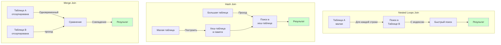

**С9.5. Анализ плана выполнения**
*   `EXPLAIN` или `EXPLAIN PLAN`: Показать план без выполнения
*   `EXPLAIN ANALYZE`: Показать план и выполнить запрос с реальными метриками
*   Чтение плана: снизу вверх, слева направо
*   Оценка стоимости: более дорогие операции имеют больший процент стоимости
*   Предупреждения: отсутствие статистики, неоптимальные операции

**С9.6. Оптимизация на основе плана**
*   Добавление индексов для Index Seek вместо Table Scan
*   Переписывание запросов для лучшего плана
*   Обновление статистики для точной оценки стоимости
*   Использование подсказок (hints) для принудительного выбора алгоритма (не рекомендуется)

---

### Блок С10: MPP и колоночное хранение (Семинар 10)

**С10.1. MPP архитектура (Massively Parallel Processing)**
*   Shared Nothing архитектура: каждый узел имеет свой процессор, память и диск
*   Параллельная обработка: запрос разбивается на части, выполняемые на разных узлах
*   Координатор (Coordinator): управляет выполнением запроса, собирает результаты
*   Рабочие узлы (Worker Nodes): выполняют части запроса

**С10.2. Колоночное хранение (Columnar Storage)**
*   Традиционное (строчное) хранение: данные хранятся по строкам
*   Колоночное хранение: данные хранятся по колонкам
*   Преимущества колоночного хранения:
    - Эффективное сжатие (одинаковые значения в колонке)
    - Быстрые аналитические запросы (читаем только нужные колонки)
    - Векторизация операций (обработка множества значений за раз)
*   Недостатки:
    - Медленные транзакционные операции (INSERT/UPDATE затрагивают много колонок)
    - Не подходит для OLTP (онлайн-транзакционная обработка)

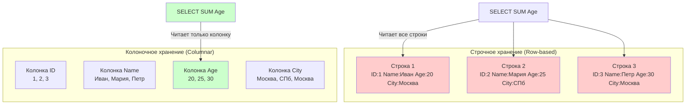

**С10.3. Vertica как пример MPP с колоночным хранением**
*   Проекции (Projections): аналог индексов, хранят данные в отсортированном виде
*   Сегментирование: распределение данных по узлам
*   Репликация: копии данных для отказоустойчивости
*   Оптимизация под аналитику: агрегации, группировки, оконные функции

**С10.4. Распределенные вычисления**
*   Локальность данных: обработка на том же узле, где хранятся данные
*   Минимизация передачи данных между узлами
*   Параллельная агрегация: каждый узел агрегирует свои данные, затем результаты объединяются
*   Балансировка нагрузки: равномерное распределение данных и запросов

**С10.5. Обеспечение отказоустойчивости в MPP**
*   Репликация данных: копии данных на нескольких узлах
*   Автоматическое переключение при отказе узла
*   Кворум: минимальное количество работающих узлов для работы системы
*   Восстановление после сбоя: перестроение данных на новом узле

---

### Блок С11: ETL и ELT процессы (Семинар 11)

**С11.1. ETL (Extract, Transform, Load)**
*   **Extract (Извлечение):** Получение данных из источников
    - Источники: операционные БД, файлы, API, веб-скрапинг
    - Методы: полная загрузка, инкрементальная загрузка (только изменения)
*   **Transform (Преобразование):** Очистка и трансформация данных
    - Очистка: удаление дубликатов, исправление ошибок, нормализация
    - Трансформация: вычисления, агрегации, объединение данных
    - Валидация: проверка качества данных
*   **Load (Загрузка):** Запись данных в целевую систему
    - Полная загрузка: замена всех данных
    - Инкрементальная загрузка: добавление новых/измененных данных
    - Обновление существующих данных

```mermaid
flowchart LR
    subgraph "ETL процесс"
        E[Extract<br/>Извлечение] -->|Сырые данные| T[Transform<br/>Преобразование]
        T -->|Очищенные данные| L[Load<br/>Загрузка]
        L -->|Готовые данные| DWH[Хранилище<br/>данных]
    end
    
    subgraph "Источники"
        DB1[OLTP БД]
        F[Файлы CSV/XML]
        API[API сервисы]
    end
    
    subgraph "Преобразования"
        Clean[Очистка<br/>Дубликаты, ошибки]
        Calc[Вычисления<br/>Агрегации]
        Val[Валидация<br/>Проверка качества]
    end
    
    DB1 --> E
    F --> E
    API --> E
    
    T --> Clean
    Clean --> Calc
    Calc --> Val
    Val --> L
    
    style E fill:#ffcccc
    style T fill:#ffffcc
    style L fill:#ccffcc
    style DWH fill:#ccccff
```

**С11.2. ELT (Extract, Load, Transform)**
*   **Extract:** Извлечение данных из источников
*   **Load:** Загрузка "сырых" данных в целевую систему (без преобразований)
*   **Transform:** Преобразование данных силами целевой системы
*   Преимущества ELT:
    - Использование мощности целевой системы для преобразований
    - Сохранение исходных данных (можно пересчитать при необходимости)
    - Подходит для Big Data и облачных хранилищ
*   Недостатки: требует мощной целевой системы

**С11.3. Сравнение ETL и ELT**
*   **ETL:** Классический подход, преобразования на промежуточном сервере
    - Подходит для: структурированных данных, небольших объемов, сложных преобразований
*   **ELT:** Современный подход, преобразования в целевой системе
    - Подходит для: больших объемов данных, облачных хранилищ, гибких схем

**С11.4. Инструменты ETL/ELT**
*   Специализированные инструменты: Informatica, Talend, SSIS (SQL Server Integration Services)
*   Облачные сервисы: AWS Glue, Azure Data Factory, Google Cloud Dataflow
*   Программные решения: Python (pandas), R, Spark

**С11.5. Проблемы и решения в ETL/ELT**
*   Качество данных: очистка, валидация, обработка ошибок
*   Производительность: параллельная обработка, оптимизация запросов
*   Мониторинг: логирование, уведомления об ошибках, метрики производительности
*   Идемпотентность: повторный запуск не должен создавать дубликаты

---

### Блок С13: In-Memory базы данных (Семинар 13)

**С13.1. Концепция In-Memory БД**
*   Все данные хранятся в оперативной памяти (RAM), а не на диске
*   Традиционные БД: данные на диске, кэш в памяти
*   In-Memory БД: данные в памяти, снимки на диск для персистентности

**С13.2. Преимущества In-Memory БД**
*   Скорость: нет операций ввода-вывода (I/O) с диска
    - Диск: миллисекунды доступа
    - Память: наносекунды доступа (в 1000+ раз быстрее)
*   Упрощенная архитектура: нет сложных буферных пулов, меньше уровней кэширования
*   Параллелизм: эффективная обработка параллельных запросов
*   Оптимизация под память: структуры данных оптимизированы для RAM

**С13.3. Недостатки In-Memory БД**
*   Ограниченный объем: память дорогая и ограниченная (по сравнению с диском)
*   Потеря данных при сбое: нужны механизмы персистентности
*   Стоимость: большое количество RAM стоит дорого
*   Не подходит для архивных данных: только "горячие" данные

**С13.4. Механизмы персистентности**
*   Снимки (Snapshots): периодическое сохранение состояния БД на диск
*   Журналирование (Logging): запись всех изменений в лог на диск
*   Комбинация: снимки + инкрементальные логи
*   Восстановление: загрузка последнего снимка + применение логов

```mermaid
graph TB
    subgraph "In-Memory БД в RAM"
        RAM[Оперативная память<br/>Все данные]
    end
    
    subgraph "Механизмы персистентности"
        S[Снимок<br/>Snapshot<br/>Периодически]
        L[Журнал<br/>Log<br/>Все изменения]
    end
    
    subgraph "Хранилище на диске"
        Disk[Диск<br/>Долговременное<br/>хранение]
    end
    
    RAM -->|Периодически| S
    RAM -->|Постоянно| L
    S --> Disk
    L --> Disk
    
    Disk -->|Восстановление| Restore[Загрузка снимка<br/>+ применение логов]
    Restore --> RAM
    
    style RAM fill:#ffcccc
    style S fill:#ccffcc
    style L fill:#ffffcc
    style Disk fill:#ccccff
```

**С13.5. Примеры In-Memory БД**
*   **SAP HANA:** Гибридная БД (колоночное хранение + In-Memory)
*   **Oracle TimesTen:** In-Memory БД от Oracle
*   **VoltDB:** Транзакционная In-Memory БД
*   **Redis:** In-Memory хранилище ключ-значение (см. блок С14)

**С13.6. Применение In-Memory БД**
*   Аналитика в реальном времени: быстрые аналитические запросы
*   Кэширование: кэш для часто запрашиваемых данных
*   Сессии пользователей: хранение сессий веб-приложений
*   Счетчики и метрики: быстрый доступ к счетчикам
*   Игровые рейтинги: таблицы лидеров

**С13.7. Гибридные подходы**
*   Горячие данные в памяти, холодные на диске
*   Автоматическая миграция данных между памятью и диском
*   Оптимизация под конкретные сценарии использования

---

### Блок С14: Redis (Семинар 14)

**С14.1. Redis - Обзор**
*   In-Memory хранилище данных структуры "ключ-значение" (Key-Value Store)
*   Открытый исходный код, очень быстрый
*   Поддерживает различные структуры данных (не только строки)
*   Используется как кэш, база данных, брокер сообщений

**С14.2. Типы данных в Redis**
*   **Strings (Строки):** Простые строки или числа
    - Команды: `SET key value`, `GET key`, `INCR key`
*   **Lists (Списки):** Упорядоченные коллекции строк
    - Команды: `LPUSH`, `RPUSH`, `LPOP`, `RPOP`, `LRANGE`
    - Использование: очереди, стеки
*   **Sets (Множества):** Неупорядоченные коллекции уникальных строк
    - Команды: `SADD`, `SMEMBERS`, `SINTER` (пересечение), `SUNION` (объединение)
*   **Sorted Sets (Упорядоченные множества):** Множества с оценками (scores)
    - Команды: `ZADD`, `ZRANGE`, `ZRANK`
    - Использование: рейтинги, таблицы лидеров
*   **Hashes (Хеши):** Карты полей и значений
    - Команды: `HSET`, `HGET`, `HGETALL`
    - Использование: объекты с полями

**С14.3. Персистентность в Redis**
*   **RDB (Redis Database):** Снимки (snapshots) данных на диск
    - Периодическое сохранение (например, каждые N секунд или при N изменениях)
    - Быстрое восстановление, но возможна потеря последних изменений
*   **AOF (Append Only File):** Лог всех команд записи
    - Каждая команда записи добавляется в файл
    - Более надежно, но медленнее и больше размер файла
*   **Комбинация:** Можно использовать оба метода одновременно

```mermaid
graph LR
    subgraph "Redis в памяти"
        R[Redis<br/>Данные в RAM]
    end
    
    subgraph "RDB - Снимки"
        R -->|Периодически<br/>каждые N сек| RDB[RDB файл<br/>Снимок состояния]
        RDB -->|Быстрое<br/>восстановление| Restore1[Восстановление]
    end
    
    subgraph "AOF - Лог команд"
        R -->|Каждая команда<br/>записи| AOF[AOF файл<br/>Лог команд]
        AOF -->|Воспроизведение<br/>команд| Restore2[Восстановление]
    end
    
    subgraph "Комбинация"
        R -->|Оба метода| Both[RDB + AOF]
        Both -->|Максимальная<br/>надежность| Restore3[Восстановление]
    end
    
    style R fill:#ffcccc
    style RDB fill:#ccffcc
    style AOF fill:#ffffcc
    style Both fill:#ccccff
```

**С14.4. Применение Redis**
*   **Кэширование:** Кэш для часто запрашиваемых данных
    - Снижает нагрузку на основную БД
    - TTL (Time To Live): автоматическое удаление устаревших данных
*   **Сессии пользователей:** Хранение сессий веб-приложений
    - Быстрый доступ, автоматическое истечение
*   **Счетчики:** Счетчики просмотров, лайков, подписчиков
    - Атомарные операции: `INCR`, `DECR`
*   **Очереди:** Очереди задач, сообщений
    - Использование Lists: `LPUSH` для добавления, `RPOP` для извлечения
*   **Таблицы лидеров:** Рейтинги игроков, топ пользователей
    - Использование Sorted Sets
*   **Pub/Sub:** Публикация и подписка на сообщения
    - Реализация паттерна издатель-подписчик

**С14.5. Особенности Redis**
*   Однопоточность: Redis обрабатывает команды последовательно (один поток)
    - Это обеспечивает атомарность операций
    - Параллелизм через несколько экземпляров Redis
*   TTL (Time To Live): Автоматическое удаление ключей через заданное время
*   Транзакции: Группа команд выполняется атомарно (`MULTI` ... `EXEC`)
*   Lua скрипты: Выполнение сложной логики на стороне сервера

**С14.6. Ограничения Redis**
*   Все данные в памяти: ограниченный объем (зависит от размера RAM)
*   Не подходит для больших объемов данных (терабайты)
*   Персистентность опциональна: возможна потеря данных при сбое (если не настроена)
*   Не реляционная БД: нет JOIN, нет сложных запросов